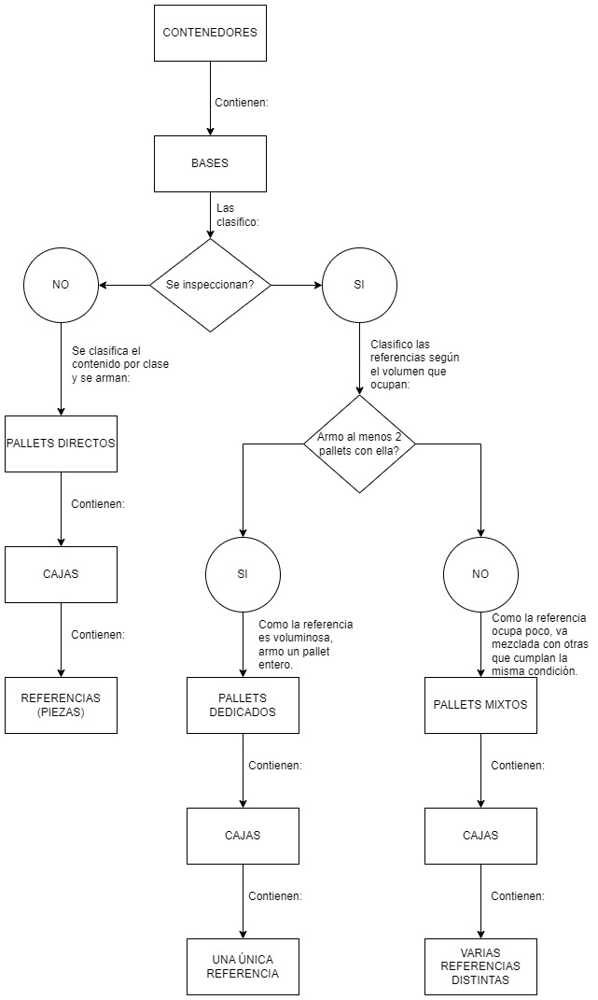

# DataScienceCoderhouse

## Comisión: 42365

### Docente: Rubén Darío González

### Tutor: Pedro Miguel Pérez

  

Este repositorio fue creado con el fin de almacenar todas las entregas de Federico Massini, para el curso de Data Science 2023 dictado por CoderHouse.

Link a presentación ejecutiva **[aquí.]([[https://github.com/antoinezanardi/werewolves-assistant-api-next/tree/main/env](https://docs.google.com/spreadsheets/d/1PeO17z4eE4ftrbbM4lVSYoR5cN5qbC2c/edit?usp=sharing&ouid=111044325679429769254&rtpof=true&sd=true](https://www.canva.com/design/DAFunxBYZVA/T_8mOwGeap-Ib5fWWcb-tQ/edit?utm_content=DAFunxBYZVA&utm_campaign=designshare&utm_medium=link2&utm_source=sharebutton)))**.

---

## 📋 Tabla de contenido

1. 🐺 [Abstract](#abstract)
2. 🃏 [Data acquisition](#data-acquisition)
3. 🔨 [Data wrangling](#data-wrangling)
4. 🚀 [Exploratory data analysis](#exploratory-data-analysis)
5. 🐳 [Predicción de packaging de cajas (usando modelos sup. de ML)](#modelos1)
6. 💯 [Clasificación de bases (usando modelos no sup. de ML)](#modelos2)
7. 🌿 [Conexión a APIs de interés](#conexión-a-apis)
8. ☑️ [Predicción de tipo de pallet (usando modelos sup. de ML)](#modelos3)
9. 📈 [Final conclusion](#final-conclusion)

## <a name="abstract">🐺 Abstract</a>

La empresa Bosch es conocida por fabricar productos diversos para todo el mundo. Recientemente comenzó a producir un nuevo producto, el cual cuenta con 5 versiones distintas.

Este producto tiene la característica de producirse de una manera diferente a lo que la empresa está acostumbrada, por ello se han desarrollado nuevos procedimientos para llevar adelante la producción.

Estos procedimientos al ser nuevos, lamentablemente distan bastante del ideal; hace falta mucho estudio y trabajo para volverlos más eficientes.

De ahí nace la necesidad de este estudio, con la información que nos proporciona el desarrollador del producto, el sector logístico deberá buscar la manera de optimizar sus procesos, para poder cumplir con los plazos de abastecimiento a planta.

De ninguna manera puede suceder que la línea productiva pare por falta de piezas a la hora de montar, logística debe hacer lo indispensable para evitar este panorama. Y a su vez, hacerlo de la manera más eficiente posible (en cuanto a tiempos y costos).

  

El siguiente dataset contiene información sobre las piezas con su respectivo código (referencia) necesarias para construir distintas versiones de un producto en específico. Estas versiones difieren ya que algunas son más completas que otras, o tienen diferentes funciones, y por ende llevan distintas piezas en su ensamblado.

La mercadería viene en cajones llamados "bases" dentro de contenedores. A su vez, cada caja dentro de estas bases tiene dentro un número determinado de piezas (indicado en el dataset). En resumen, las piezas vienen en cajas, las cuales vienen en bases, las cuales a su vez vienen en contenedores. Toda esta información está detallada en el dataset, donde se indica incluso dimensiones, pesos y tipo de packaging de las bases o cajas.

Cada fila además aclara a que versión del producto pertenece la pieza, hay piezas comunes a todos y otras que no lo son. Una vez traidos los contenedores, las piezas deberán separarse en clases. La clase de una pieza determina de qué forma se ensambla, por lo que es necesario clasificar todo antes de comenzar a ensamblar el producto.

Algunos puntos interesantes a ver en este estudio:

1. Como se distribuyen las referencias entre las clases? Hay alguna que contenga más variedad?
2. Para contar con el total de piezas de una referencia, cuantas cajas se deben abrir aproximadamente?
3. Las bases, cuantas cajas traen? Y referencias? Cómo viene la mercadería distribuída?
4. Cada referencia, en cuantas versiones se usa? Hay muchas comunes a todas?
5. Qué clase conlleva más volumen?
6. Cuáles versiones son más parecidas/diferentes entre si?
7. Existe algún patrón entre las bases? Se pueden clasificar?
8. Se puede preever cual será el tipo de pallet en el cual irá una referencia, solo conociendo información de ella misma?

Por otro lado, en determinadas ocasiones sucede que logística tiene rotura de piezas, las cuales es necesario reponer. Para esto, se hacen solicitudes al proveedor de envíos puntuales, con la mercadería específica que se necesita.

Esta mercadería puede venir en diferentes tipos de packaging, el cual determina las condiciones de almacenamiento a posteriori. De ahí, se abren otros puntos interesantes a analizar:

9. En el caso de que logística necesite pedir un envío especial de piezas a reponer, es posible predecir en qué tipo de packaging lo enviará el proveedor?
10. Qué variables son importantes a la hora de predecir dicho packaging?
11. Es posible deducir qué lógica usa el proveedor para seleccionarlo?
12. Cuántos días demora un envío? Qué tanto varía según cuál sea el país de destino?
13. Qué variable es más importante a la hora de calcular el costo del envío? El peso? El volumen? Otra?
14 .Cual sea la variable de la respuesta anterior, también afecta los días que demora un envío en llegar?

Todos estos puntos indudablemente ayudan a optimizar el proceso de ingreso de la mercadería, tanto para lo que es inspección como para almacenamiento y traslado. Es crítico que todas las piezas se encuentren en el lugar correcto a la hora de producir, y lo que buscamos es volver más eficiente el camino a dicho objetivo.

**[Fuente aquí.]([https://github.com/antoinezanardi/werewolves-assistant-api-next/tree/main/env](https://docs.google.com/spreadsheets/d/1PeO17z4eE4ftrbbM4lVSYoR5cN5qbC2c/edit?usp=sharing&ouid=111044325679429769254&rtpof=true&sd=true))**.

## <a name="data-acquisition">🃏 Data acquisition</a>

### Diccionario de columnas del DS

COLUMNA |	DESCRIPCIÓN |	EJEMPLO 1 |	EJEMPLO 2
CLASE |	Sector en el cual se ensambla esta pieza | F1 |	A
VERSION |	Versión del producto al cual pertenece esta pieza |	M42 |	A42
CONTENEDOR |	Contenedor en el cual viene esta pieza |	CMAU4908460 |	MRSU3285393
BASE |	Base en la cual viene esta pieza |	AF0001 |	MP001
TIPO BASE |	Tipo de base |	IRON FRAME |	IRON FRAME
LARGO BASE |	Largo de la base en mm |	2110 |	2250
ANCHO BASE |	Ancho de la base en mm |	600 |	1700
ALTURA BASE |	Altura de la base en mm |	1200 |	1050
PESO BASE |	Peso de la base en kg |	205 |	861.0
CAJA |	Caja en la cual viene esta pieza |	AF0001 |	MC0072
TIPO CAJA |	Tipo de caja |	IRON FRAME |	CARTON
LARGO CAJA |	Largo de la caja en mm |	1700 |	800
ANCHO CAJA |	Ancho de la caja en mm |	100 |	500
ALTURA CAJA |	Altura de la caja en mm |	130 |	530
PESO CAJA |	Peso de la caja en kg |	153.92 |	13.85
REFERENCIA |	Código de esta pieza |	2804110-BU01 |	6900006P201D
UNID/CAJA |	Cantidad de esta pieza que viene en la caja |	16 |	16

### Diagrama de la operativa

  

## <a name="data-wrangling">🔨 Data wrangling</a>
## <a name="exploratory-data-analysis">🚀 Exploratory data analysis</a>
## <a name="modelos1">🐳 Predicción de packaging de cajas (usando modelos sup. de ML</a>
## <a name="modelos2">💯 Clasificación de bases (usando modelos no sup. de ML</a>
## <a name="conexión-a-apis">🌿 Conexión a APIs de interés</a>
## <a name="modelos3">☑️ Predicción de tipo de pallet (usando modelos sup. de ML)</a>
## <a name="final-conclusion">📈 Final conclusion</a>
